# Acoustics Calculator

A simple interactive calculator for making quick measurements of sound propagation in rooms.

**GitHub Repository:** https://github.com/victorzottmann/acoustics-calculator

**Implementation Plan (Trello Board):** https://trello.com/b/lt2oU2NT/terminal-app

## Statement of Purpose and Scope

The purpose of this calculator is to facilitate access to on-the-go measurements of room acoustics parameters. Being fairly complicated to conduct, such measurements often require professional equipment and digital signal processing techniques, which can be very expensive and impractical in many circumstances. Notwithstanding the necessary technologies, what makes calculating room acoustics parameters cumbersome is the plethora of equations that are dependent on one another. Indeed, there are quite a few softwares the solve this problem, although they are used by engineers or consultants rather than the general public. 

A particular use case of a room acoustics calculator would be for when musicians, video editors, or even sound designers are looking to treat their studios (or home studios) with the appropriate acoustic materials. In cases like such, a robust acoustic analysis of a room would not be necessary; rather, simple and on-the-go estimates of how sound would behave before and after treatment can be good enough.

### Features List - MVP

- As a user, I want to be able to calculate everyday parameters, such as sound level attenuation over distance, conversion between sound power level and sound pressure level, and check the speed of sound in relation to temperature.

- As a user, I want to be able to check how loud will many different sound sources be (e.g. two or more loudspeakers; overall level of one or multiple construction sites near offices, schools, or hospitals).

- As a user, I want to estimate the reverberation time of a room in relation to the amount of absorption it has. 

  

### Features List - Future Implementations

- As a user, I would like to know whether the estimated reverberation time of a room is within the recommended values established by the Australian / New Zealand Standard  ***"Acoustics - Recommended design sound levels and reverberation times for building interiors (AS/NZS 2107-2016)"***.

- As a user, I would like to be able to calculate the amount of room modes (frequency resonances), given the dimensions of a room.

- As a user, I would like to be able to calculate the transmission loss between rooms, as well as between outdoors and indoors spaces. 

- As a user, I would like to see the absorption coefficients of the materials I choose when calculating reverberation time.


## Available Features 

As soon as the user load the application, a Welcome window introduces them to all the possible calculations they can perform, as well as with an option to exit the program. Each calculation has its own menu, which introduces the user to what will be displayed and how should they use it. On the other hand, the main menu simply asks the user what do they want to calculate, as shown in the image below.

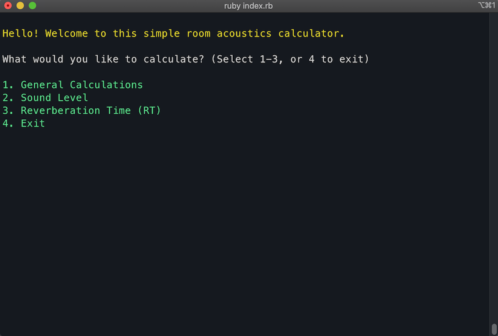

### General Calculations

At the moment, only one general calculation has been implemented in the calculator: the speed of sound, which is dependent on temperature. It is important to include the speed of sound (and the temperature) in any reported measurements.

```ruby
temperature = 20 # Celsius

speed_of_sound = 331.3 * Math.sqrt(1 + (temperature / 273.15))

speed_of_sound = 343 # m/s
```


### Sound Level 

In the Sound Level menu, the user is presented with a total of four calculations, and the option to exit the program. The four calculations are the following.

1. **A-Weighting Conversion**

   A-Weighting is a frequency weighting that accounts for the sensitivities and limitations of our hearing. Often times when sound pressure level is measured, the decibels by themselves do not say much about how loud would it actually be to people. For example, the following graph, called the Equal Loudness Contour, illlustrates sound pressure level as a function of frequency. What the contour means is that for low frequencies to sound equally as loud as higher frequencies, their sound pressure levels must be higher than those of higher frequencies. 

   For example, as highlighted in **BLUE**, for 100 Hz to be perceived equally as loud as 1000 Hz (highlighted in **RED**), the sound pressure level must be 30 dB, as opposed to only 10 dB for 1000 Hz. In other words, our hearing is much more senstive to higher frequencies than low frequencies. 


Therefore, in order to account for such limitations, the A-Weighting curve is applied by subtracting values from lower frequencies and adding to the higher frequencies. The graph below (NTI Audio, n.d.) shows the three most commonly used frequency weighting curves. Z-Weighting is simply the unweighted, or "linear" sound pressure levels; the C-Weighting curve is used for industrial purposes.

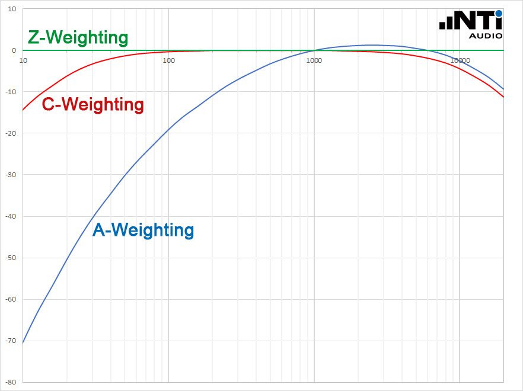

To understand better how the A-Weighting curve related to our hearing, below is an inverted version of the equal loudness contour. It is evident that the curve follows, indeed, the frequency sensitivities of our hearing.


Finally, the table below demonstrates how the A-Weighted conversion is made given a set of sound pressure levels. In this case, the levels used belong to the standardized level of speech (Australian / New Zealand Standards).


##### Code Highlights - A-Weighting Conversion

- Variables

```ruby
puts "\nPlease input sound levels for the following octave bands (63Hz - 8000Hz):\n\n"

octave_levels = []

print "63Hz: ".colorize(:green) #
first = gets.chomp.to_f
print "125Hz: ".colorize(:green)
second = gets.chomp.to_f
print "250Hz: ".colorize(:green)
third = gets.chomp.to_f
print "500Hz: ".colorize(:green)
fourth = gets.chomp.to_f
print "1000Hz: ".colorize(:green)
fifth = gets.chomp.to_f
print "2000Hz: ".colorize(:green)
sixth = gets.chomp.to_f
print "4000Hz: ".colorize(:green)
seventh = gets.chomp.to_f
print "8000Hz: ".colorize(:green)
eighth = gets.chomp.to_f
```


- Mapping and adding the inputted sound levels with the a-weighted values to a new array.

```ruby
octave_levels.push(first, second, third, fourth, fifth, sixth, seventh, eighth)
a_weighting = [-26.2, -16.1, -8.6, -3.2, 0, 1.2, 1.0, -1.1]

# the transpose method is joining the same index position of each array,
# then the inject method adds them up.
conversion = [octave_levels, a_weighting].transpose.map {|i| i.inject(:+)}

puts "\nThe A-Weighted sound pressure levels are:\n\n"

# A placeholder frequency is needed because the first octave band is 63Hz instead of 62.5Hz
# The reason for this is because these are integer octave bands, so rounding up to 63Hz is needed
freq = 31.25
conversion.each do |i|
  freq *= 2
  if freq == 62.5
    puts "#{freq.ceil}Hz = %0.1f dB(A)".colorize(:cyan) % [i] # The ceil method rounds numbers up.
  else
    puts "%.0fHz = %0.1f dB(A)".colorize(:cyan) % [freq, i]
  end
end
```

---

2. **Level Attenuation Over Distance**

   Level attenuation is concerned with how loud the sound source will be at the receiver distance. The sound pressure level (SPL) of the source is usually measured at 1m from it, and for every doubling of distance there will be a reduction of 6 decibels (dB). For example, if the sound pressure level of someone singing is 70 dB at 1m, at 2m the resulting SPL will be 64 dB; at 4m it will be 58 dB, and so on. The formula for calculating this is shown below.

```ruby
level_difference = level - 20 * Math.log10(r / r_reference)

# Example:
level_difference = 70 dB - 20 * Math.log10(2 / 1) # => 70 dB - 6 = 64dB

```

Where `r` is the distance between the source and the receiver, and `r_reference` is the reference distance from which the SPL was measured `(e.g. r = 2m, r_reference = 1m)`. 

---

3. **Level Conversion (Sound Power Level to Sound Pressure Level, or Vice-Versa)**

   The difference between sound power level and sound pressure level is that the former is related to the acoustic energy that is emitted from the sound source itself. On the other hand, sound pressure level is essentially what we hear. Another way of thinking about this is with light bulbs. In code, the conversion would be written this way:

   ```ruby 
   # Sound Power Level to Sound Pressure Level:
   # The distance parameter is the distance where the receiver (person) is in relation to the source.
   def self.power_to_pressure_level(power_level, distance)
     # PI = 3.14
     pressure_level = power_level + (10 * Math.log10(1 / (4 * PI * (distance * distance))))
   
     output = "\nThe resulting Sound Pressure Level is %.1f dB." % [pressure_level]
     return output
   end
   
   # Sound Pressure Level to Sound Power Level:
   # The distance parameter serves the same purpose as above.
   def self.pressure_to_power_level(pressure_level, distance)
     # PI = 3.14
     power_level = (pressure_level - (10 * Math.log10(1 / (4 * PI * (distance * distance)))))
   
     output = "\nThe resulting Sound Power Level is %.1f dB." % [power_level]
     return output
   end
   ```

   

---

4. **Sum and Average of Levels**

   - Sum

     Adding decibels is not the same as adding two numbers. For example, 60 dB + 60 dB = 63 dB, not 120 dB. The reason for this is because our hearing is not measured in a linear scale, but in a logarithmic scale. Since sound is simply disturbances in air pressure that our brain interpret as sound, in order to add decibels it is necessary to "undo" the decibels back into pressure-squared values (measured in pascal units (pa)), add them up, then take the logarithm of the sum, which will result in the correct value. For example:

     ```ruby
     level = 60
     
     db_to_pressure = 10 ** (level / 10) = 1,000,000 pa # (or 1 x 10^6 pa)
     
     # So 60 dB + 60 dB = 2,000,000 pa (or 2 x 10^6 pa)
     
     pressure_to_db = 10 * Math.log10(2 x 10^6) # => 63 dB
     ```

   - Average

     The process is exactly the same as that of adding decibels, except that instead of adding the pressure-squared values, they are averaged, then converted back to decibels using the same equation demonstrated above.

     

   In code, both the sum and the average calculations would be written as the following.

   ```ruby
   puts "\nPlease input an array of sound pressure levels (SPL) separated by a space:"
       
   input = gets.chomp.split(" ")
   input = input.map(&:to_f)
   
   # Sum of levels
   total_sum = 0
   
   level_sum = input.map {|i| 10 ** (i / 10)}
   level_sum.each {|i| total_sum += i}
   
   # Average of levels
   total_avg = 0
   total_indices = input.length
   
   level_avg = input.map {|j| (10 ** (j / 10)) / (total_indices)}
   level_avg.each {|j| total_avg += j}
   ```

   

   

### Reverberation Time

Reverberation time is the amount of time the level of a sound source takes to decay 60 dB (see image (NTI Audio, n.d.) below).

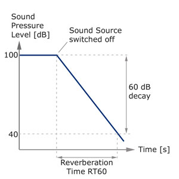

The difference between a reverberant room and one that does not have much reverb (or none for the matter) is that the latter would contain more absorption. Hence, it could be argued that reverberation time is inversely proportional to absorption. Take the following two images for example. The first one, taken inside an empty living room, is comprised of hard surfaces, such as windows and a very reflective floor. When surfaces are flat, stiff and not porous, sound would not be absorbed by them, but rather the waves would reflected between them, thus building up sound and resulting in reverberation. Examples consist of garages, bathrooms, corridors, hallways, etc.


On the other hand, a completely absorptive room, also known as an anechoic chamber, would have all surfaces made of highly absorptive material so as not to have any reverberation. Such a room would not be used by the general public, of course; they exist in order to conduct specific acoustic measurements that cannot be inteferred by reverberation.

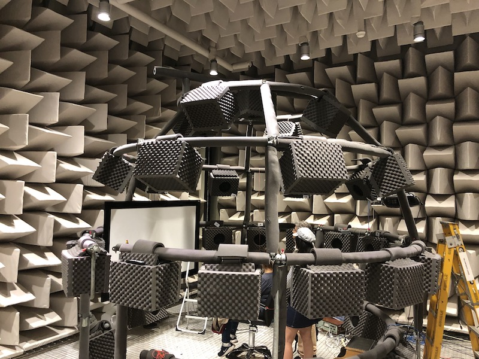


### Calculating Absorption

In order to calculate the reverberation time of a room, it is necessary to identify which materials compose the room, as well as their absorptions coefficients. The coefficients indicate how well does a material absorb sound, where 0 indicates no absorption, and 1 complete absorption (see the table below). Furthermore, as mentioned above, materials that are harder and flatter will not have good absorption, whereas those that are porous and fluffy will. 


Below is a quick example of the process of calculating the total absorption of the room, and therefore the reverberation time. First, it is necessary to get the dimensions of the room, including `volume`, `surface areas` of each wall, and the `total surface area` of the room. Then, for each surface, it is necessary to multiply the absorption coefficients of a given material with the surface area in which the material will cover. The result will be absorption per square metre.


Finally, to get the total absorption, the absorption calculated for every octave band (frequency) must be summed up, as shown in the image below. The process for finding the average is the same.

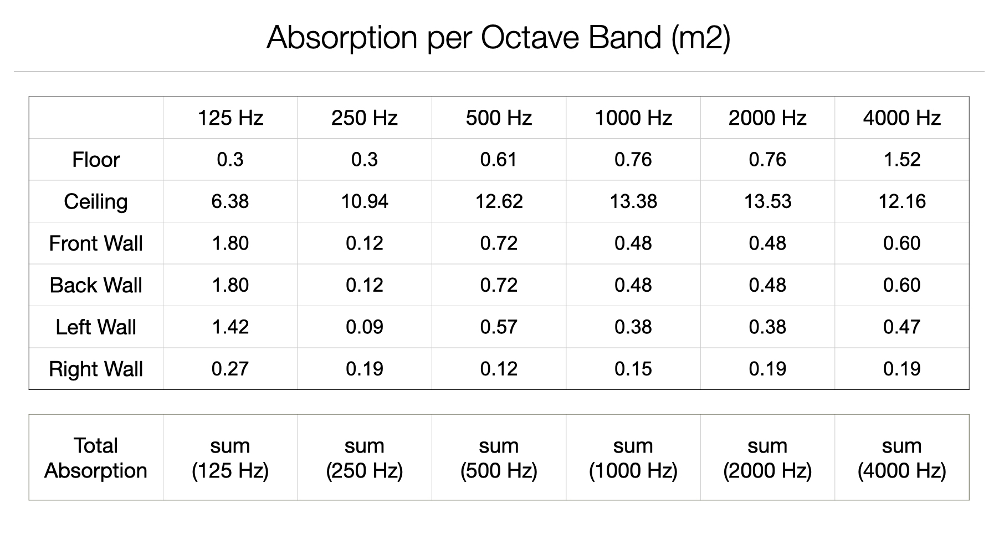


### Calculating Reverberation Time

Now that all the absortion values are available, calculating reverberation time is rather straightforward. There are two main equations that are commonly used, although for different situations: the Sabine equation, and the Norris-Eyring equation.

##### Sabine Equation:

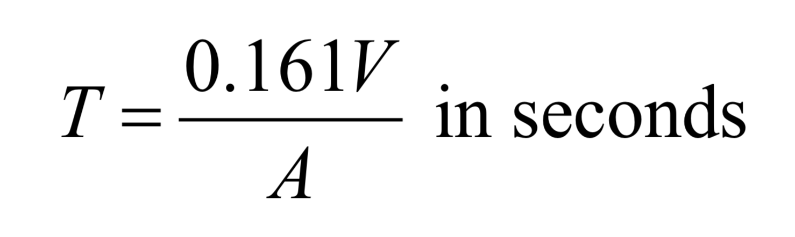

Where: <br>
V is the volume of the room <br>
A is the total absorption

---

##### Norris-Eyring Equation:

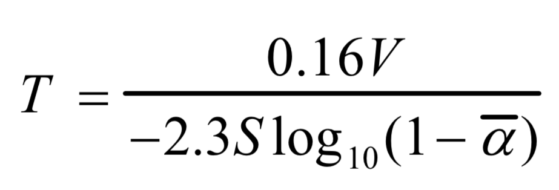

Where:<br>
 V is the volume of the room<br>
S is the total surface area<br>
a is the average absorption coefficient

---

Generally speaking, the Sabine equation tends to be more precise in "live" rooms (i.e. with more reverberation), whereas the Norris-Eyring equation tends to be more precise in "dead" rooms (i.e. from little to no reverberation). Although there are far more robust methods for measuring reverberation time, such as using professional equipment to conduct physical measurements, using the equations above give very good estimations of reverberation time.

### Code Highlights - Reveberation Time

The following code snippets illustrate the key logic happening to calculate the above-mentioned parameters. 

1. Absorption Coefficients

   The coefficients are stored in an array of hashes, where the first `key` has the name of the material as its `value`; the second `key` has another hash as its value, whose `keys` are the octave bands, and `values` the absorption coefficients.

```ruby
module Absorption

  Coefficients = [
    ## Floor
    {
      material: "thin_carpet_concrete",
      coeffs: {
        "125Hz" => 0.10,
        "250Hz" => 0.15,
        "500Hz" => 0.25,
        "1000Hz" => 0.30,
        "2000Hz" => 0.30,
        "4000Hz" => 0.30
      }
    },
    ...
  ]
  
end
```


2. Key variables for calculating absorption and reverberation time.

```ruby
    floor_coeffs = {}
    ceiling_coeffs = {}
    front_wall_coeffs = {}
    back_wall_coeffs = {}
    left_wall_coeffs = {}
    right_wall_coeffs = {}
    door_coeffs = {}
    window_coeffs = {}

    floor_absorption = {}
    ceiling_absorption = {}
    front_wall_absorption = {}
    back_wall_absorption = {}
    left_wall_absorption = {}
    right_wall_absorption = {}
    door_absorption = {}
    window_absorption = {}

    floor_surface_area = 0.0
    ceiling_surface_area = 0.0
    front_wall_surface_area = 0.0
    back_wall_surface_area = 0.0
    left_wall_surface_area = 0.0
    door_surface_area = 0.0
    window_surface_area = 0.0

    total_surface_area = 0.0
```


3. User input for surface areas

   For this part, a variable called `proceed` is set to `false` before entering the `while`loop. 
   While `!proceed` (true), the loop checks if the surface area is valid by using the `Validators` method.
   If the `valid_area` is false, then it displays and error and calls `!proceed`again.

```ruby 
puts "\nBefore we proceed, I need to know some of the properties of the room."
puts "\nPlease input the following SURFACE AREAS (m2):\n\n"

proceed = false
while !proceed
  puts "Floor / Ceiling: ".colorize(:green)
  ceiling_surface_area = floor_surface_area = gets.chomp.to_f
  valid_area = Validators.validate_room_dimensions(floor_surface_area)
  if !valid_area
    Validators.invalid_number_error()
    !proceed
  else
    break
  end
end
```


4. This code snippet demonstrates the process of populating the `floor_coefficients` and `floor_absorption` hashes. Since the steps for the second `when` case is identical to the first, the three dots simply indicate that the rest is hidden from this snippet. The process is the same for every other surface of the room.

```ruby
puts "\nPlease select one of the following materials (1-2), then hit Enter to continue:"
while true
  puts "\nFloor:" 
  puts "\n1. Thin carpet on concrete".colorize(:green)
  puts "2. Wood on joists".colorize(:green)
  floor_type = gets.chomp.to_i
  case floor_type
  when 1
    Absorption::Coefficients.each do |key|
      if key[:material] == "thin_carpet_concrete"
        floor_coeffs = key[:coeffs]
      end
    end
    floor_coeffs.each do |frequency, coeff|
      floor_absorption[frequency] = (coeff * floor_surface_area).truncate(2)
    end
    break
  when 2 ...
  else
    Validators.invalid_material_error()
  end
end
```


5. This snippet shows the process applied for extracting the final absorption calculations and mapping them into their respective octave bands (125Hz - 4000Hz).

```ruby 
# This assigns the surface areas of all surfaces to the total_surface_area variable.
total_surface_area = floor_surface_area + ceiling_surface_area + front_wall_surface_area + back_wall_surface_area + left_wall_surface_area + right_wall_surface_area + door_surface_area + window_surface_area

# This array is populated with all octave bands absorption (125Hz - 4000Hz), for all surfaces.
absorption_all_surfaces = Array.new
absorption_all_surfaces.push( 
  floor_absorption, 
  ceiling_absorption, 
  front_wall_absorption, 
  back_wall_absorption, 
  left_wall_absorption, 
  right_wall_absorption, 
  door_absorption, 
  window_absorption
  )

# This extracts the sum of all absorption values for each octave band
# and maps them to individual total absorption arrays.
total_absorption_125Hz = absorption_all_surfaces.map{|freq| freq["125Hz"]}.inject(:+)
total_absorption_250Hz = absorption_all_surfaces.map{|freq| freq["250Hz"]}.inject(:+)
total_absorption_500Hz = absorption_all_surfaces.map{|freq| freq["500Hz"]}.inject(:+)
total_absorption_1000Hz = absorption_all_surfaces.map{|freq| freq["1000Hz"]}.inject(:+)
total_absorption_2000Hz = absorption_all_surfaces.map{|freq| freq["2000Hz"]}.inject(:+)
total_absorption_4000Hz = absorption_all_surfaces.map{|freq| freq["4000Hz"]}.inject(:+)

# This hash then stores the total absorption of all octave bands.
total_absorption = {
  "125Hz" => total_absorption_125Hz,
  "250Hz" => total_absorption_250Hz,
  "500Hz" => total_absorption_500Hz,
  "1000Hz" => total_absorption_1000Hz,
  "2000Hz" => total_absorption_2000Hz,
  "4000Hz" => total_absorption_4000Hz
  }

# A similar approach is taken for the average absorption coefficients, except for the calculation.
avg_absorption_coeff_125Hz = (total_absorption_125Hz / total_surface_area).truncate(2)
avg_absorption_coeff_250Hz = (total_absorption_250Hz / total_surface_area).truncate(2)
avg_absorption_coeff_500Hz = (total_absorption_500Hz / total_surface_area).truncate(2)
avg_absorption_coeff_1000Hz = (total_absorption_1000Hz / total_surface_area).truncate(2)
avg_absorption_coeff_2000Hz = (total_absorption_2000Hz / total_surface_area).truncate(2)
avg_absorption_coeff_4000Hz = (total_absorption_4000Hz / total_surface_area).truncate(2)

avg_absorption_coeffs = {
  "125Hz" => avg_absorption_coeff_125Hz,
  "250Hz" => avg_absorption_coeff_250Hz,
  "500Hz" => avg_absorption_coeff_500Hz,
  "1000Hz" => avg_absorption_coeff_1000Hz,
  "2000Hz" => avg_absorption_coeff_2000Hz,
  "4000Hz" => avg_absorption_coeff_4000Hz
  } 
```


## Outline of the User Experience

- The app has a very simple design, in that the interactions are made by displaying welcoming instructions to the user, requesting input, then displaying the calculation results to the user.

- Two methods of interaction were implemented: 

  1. Selection of options using the TTY Prompt Ruby gem

  2. Choosing an options by inputting a number.

     In this case, whenever the user gives the wrong input, a warning is displayed, requesting the user to repeat the input. This is not possible with TTY Prompt, which is why this method was chosen –– that is, so that the application got to be more dynamic.  

- Erros are handled through validation methods stored in a separate `validators.rb` file. Depending on the input being required, some may display graphic error messages, whereas other will simply check whether an input is `true` or `false`. A use case of this is when checking for a condition in a `while` loop. If it is `false`, then it triggers the graphic error method and loops back to be beginning. Otherwise, the loop breaks. The graphic error message is created with the TTY Box gem.


## Flowcharts

### Index - Main Menu

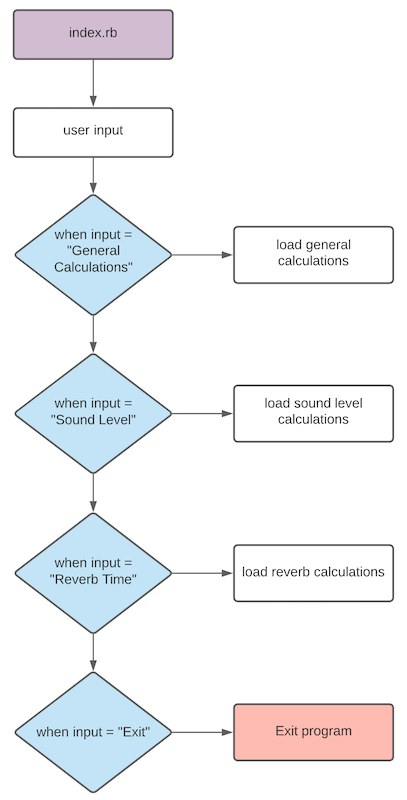

---

### General Calculations

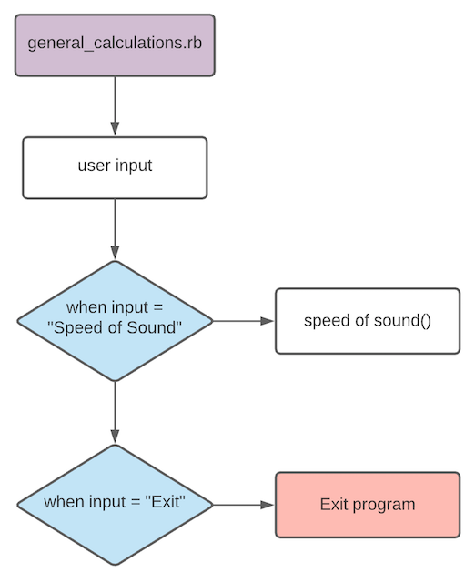

---

### Sound Level Calculations

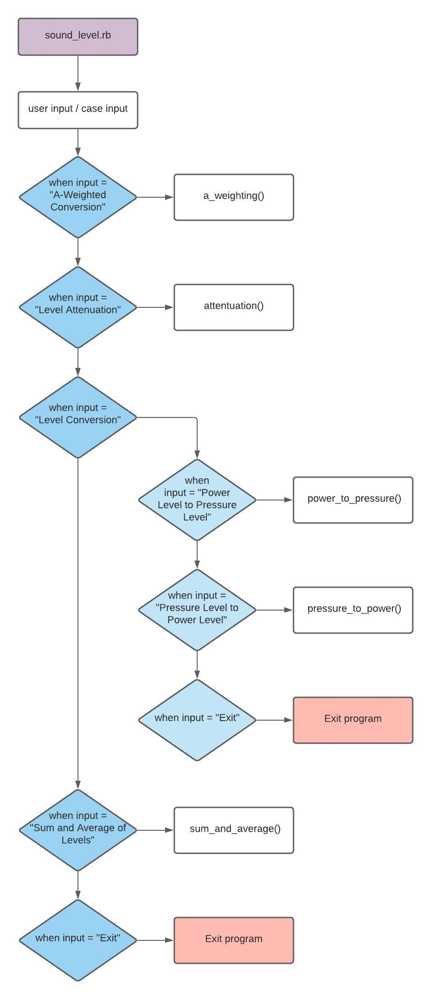

---

### Reverb Time Calculations

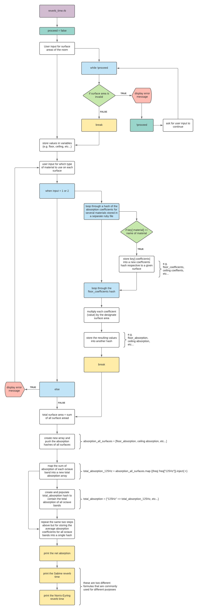


## HELP - How to Install and Use the Application

#### Dependencies:

- Ruby
- Bundler (Ruby gem)
- Colorize (Ruby gem)
- TTY-Box (Ruby gem)
- TTY-Prompt (Ruby gem)
- Rspec (Ruby gem)
- Zsh (Command Line Shell)

#### To install and run:

Installing Zsh:

​	`$ brew install zsh`  - brew is short for Homebrew, which is a package manager.

Installing the Gems:

- `$ gem install bundler`
- `$ gem install colorize`
- `$ gem install tty-box`
- `$ gem install tty-prompt`
- `$ gem install rspec`

Running the program:

​	`$ ruby index.rb`


## References

NTI Audio. (n.d.). Frequency Weightings for Sound Level Measurements. Retrieved from https://www.nti-audio.com/en/support/know-how/frequency-weightings-for-sound-level-measurements

NTI Audio. (n.d.). Reverberation Time (RT60) Measurement. Retrieved from https://www.nti-audio.com/en/applications/room-building-acoustics/reverberation-time-rt60-measurement


